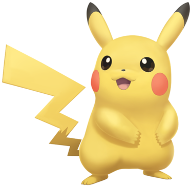

## Introduction

This website is the result of a project made during a teaching unit done by the 
[FRB-CESAB](https://www.fondationbiodiversite.fr/en/about-the-foundation/le-cesab/)
in Montpellier (December 2021). All informations given in this website are
based on the [toolbox](https://frbcesab.github.io/datatoolbox/) done for the teaching.

This website is about coding in a reproducible workflow **using R** and is especially made for ecological studies but most concepts can be used for any study.

## What is Reproducible Research?

Doing a **reproducible research** is providing a "clean, repeatable script-based workflow" [Bristish Ecological Society 2018](https://www.britishecologicalsociety.org/wp-content/uploads/2017/12/guide-to-reproducible-code.pdf) linking raw data to final analysis and outupts. It is important to follow a reproducible workflow so that **other people can re-run your code or that a future version of you can easily redo the analysis**! 

It relies on several important points that are explained in the different tutorials (*cf Tutorials and examples* down below):

* Project organisation: you have to correctly organise your working directory by creating a Research Compendium which have defined directories  (*cf Let's Create a Research Compendium* tutorial)

* Data management: you have to **keep raw data** and 
save intermediate data. **Never** overwrite raw data!  
If raw data you used is download, it is better if you automate their obtention (using `download.file()` function for instance). 

* Softwares - Scripts: you have to **respect the agreements of the community you work in**, for instance style rules on objects names or scripts aesthetic (example: [tidyverse rules](https://style.tidyverse.org/)). One basic rule when writing R scripts is for instance to always use a relative path (where the file is according to the working directory)

* Softwares - Environment: you have to indicate the version of used packages (*cf* the renv package using the *Create and isolted and portable environment using renv* tutorial) because some functions/parameters can change between packages versions. You can also track the version of R you are working on or the Operating System version (using for instance the Docker package *cf* [Introduction of Docker for R Users by Colin Fay](https://colinfay.me/docker-r-reproducibility/))

* Softwares - Workflow: scripts succession can be automated using a `make.R` file (*cf Let's Create a Research Compendium* tutorial) or the target package: (*cf Create an automatised workflow* tutorial)

* Tracking Changes: using a version control software as  Git (*cf Use Git and Github* tutorial).

* Collaboration: you have to use a place to exchange to share your code, where you can collaborate with others and where other people can suggest modifications or improvement of your code throught Github or GitLab (*cf Use Git and Github* tutorial). To be able to collaborate with others you also have to **document** your project, notably by using a `README` file (*cf Let's Create a Research Compendium* tutorial)

* Manuscripts: you can automate the writing process by using **literate programming** combining writing, code and figures using Rmarkdown 

## Tutorials and examples

In this website, we propose a set of tutorials to learn how to do reproducible research!  
Each tutorial contains R chunks so you can run the analysis using a **Pokemon dataset**

We used R and RStudio (so screenshots are made under Rstudio). So that the tutorials correctly work, **please be sure that you have a R version >= 4.0.0, that Git, Github are configurated to communicate with R and that your computer have everything needed to read Rmarkdown file**.
[Here](https://frbcesab.github.io/datatoolbox/instructions.html) are instructions to do so (*in french*) 

If you are new to the subject, you can follow the tutorials in this order:

* 1 - Let's Create a Research Compendium!

* 2 - Use Git and Github 

* 3 - Create and define your first R function 

* 4 - Use and automatised workflow: using make.R or the target package

* 5 - Create and isolated and portable environment using renv

Now let's do reproducible research!

{width=200px}

