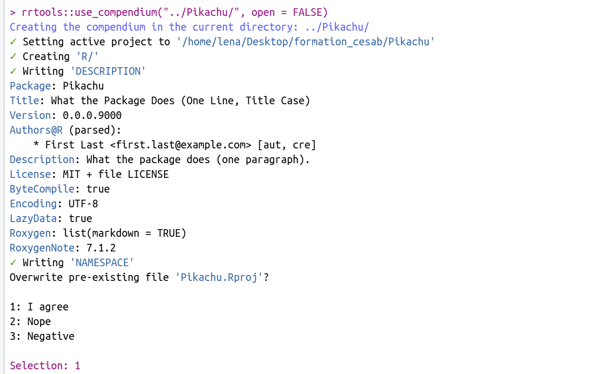
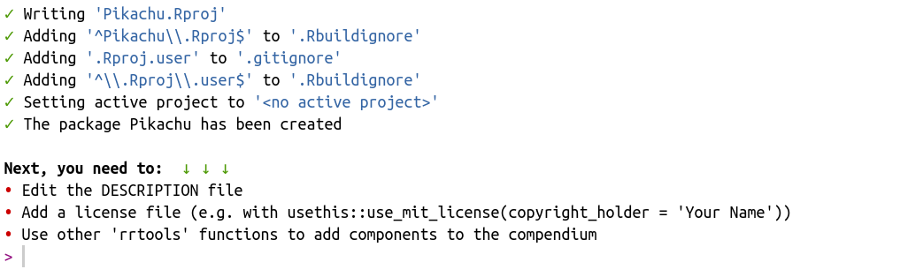
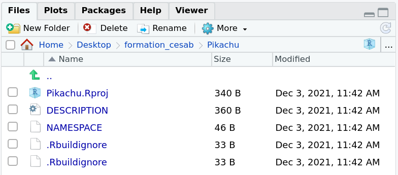
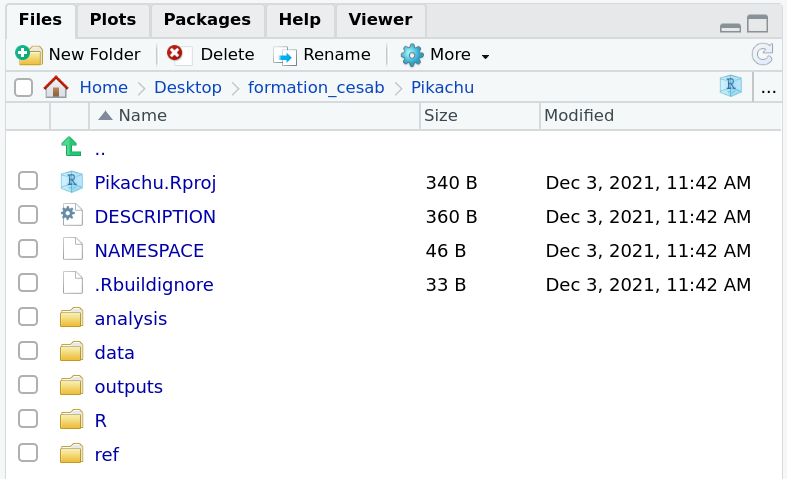

<style> body {text-align: justify} </style>


## Create a research compendium

A research compendium is a folder providing data, code, and documentation, i.e. all you need to get a reproducing a scientific workflow ! To create this amazing tool, open RStudio and create a new R-Project : *File > New Project...*

{width=400px}

Choose *New Directory* and then *New Project*.

{width=400px}
A new R-Project is create, it looks like this : 

{width=800px}

Now the project is created, we are going to organize it as a compendium. To do so, write the following command in the R console :  

```{r, eval=FALSE}
rrtools::use_compendium("../Pickachu/", open = FALSE)
```
  
{width=800px}

{width=800px}
  
This function will create 4 new documents : 2 visible (DESCRIPTION and NAMESPACE) and 2 invisible (.Rhistory, .Rbuildignore.). DESCRIPTION is an important file : it will be used to store the packages versions of the project, for good reproducible work ! 

{width=400px}


# Complete your project architecture  

Now you can complete your folder architecture with more personal folders. Because you may work with datas, I suggest you to do something like that: 

{width=200px}

The following folders are created in your R-Project.

{width=400px}

The idea is to store you data in the *data* file, write the functions in the *R* file, and write the scripts for your different analysis in *analysis*. The results of those analysis will be stored in *outputs*.

Do you know that they are many articles about Pokemon [@Kawahara2018] ? 

##### References 
