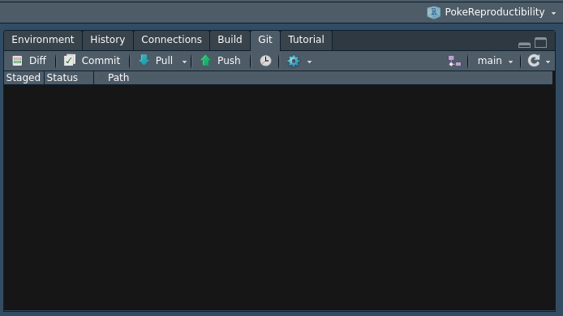
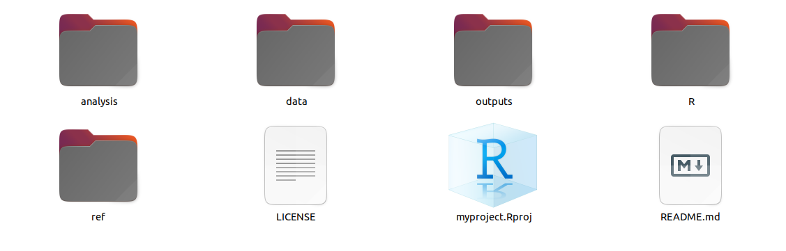

<style> body {text-align: justify} </style>

### 1) Creat a new repository on GitHub  

Connect to your GitHub account. Go on **Repositories** tab and click to **New**. For the following exemple I suggest you to name your new GitHub repository **Pickachu** and add a README file, a licence (GNU Affero General Public License v3.0) and a .gitignore (R). By doing that you will create a new repository on GitHub containing 3 files : a .gitignore, a LICENSE and a. README.md visible on github. Then go on **code** tab and copy the SSH link.  

### 2) Install the GitHub repository on your computer 

Now open Rstudio and go here *file* > *new project* > *version control* > *git* past the SSH link and choose the location of the file **Pickachu** that will contain your future project. 
Now if you open your **Pickachu** file on you local computer you will see 3 files: a .Rproj, the LICENSE and the README.md. However 3 others invisible files are in your **Pickachu** file: a .gitignore, a .git and a .Rproj.user. They don’t appear because they are hidden. However you can see them on R studio, GitHub and if you reveal hidden files. 

### 3) Create a research compendium

A research compendium it’s just a folder providing data, code, and documentation for reproducing a scientific workflow. To create it, open again your R Studio window and be sure to be inside your project that appear at the right top corner of your Rstudio, here : 

```{r, echo=FALSE, fig.cap="Check that you are inside your project !", out.width = '50%'}

```

Now go in the R console and do:  
`rrtools::use_compendium("../Pickachu/", open = FALSE)`.  
This function will create a compendium inside your project. By doing so you will create 4 new documents: 2 visible: DESCRIPTION and NAMESPACE and 2 invisible: .Rhistory, .Rbuildignore. DESCRIPTION is an important file because it will save all the packages version you will use during your study in order that other will reproduce your work easily. 

### 4) Construct your project architecture  

Now you can complete your folder architecture of your project. Because you may work in science, I suggest you to do something like that: 

```{r, echo=FALSE, fig.cap="This is a cool architecture", out.width = '65%'}

```

Bellow see some general advises:  

* It’s important to clearly separate the data from the analysis from the outputs. In each folder you will have various script to manipulate, analyse and plot the data.    

* At the root it's recommended to create a make.R file. This R file will be the master of all the other R files. In this file you will call all the other script contained in you various folders in other to run your whole study in one run.    

* You can also create a R folder. This folder will contain various script only composed of the various functions you will need in your project.  

Do you know that they are many articles about Pokemon [@Kawahara2018] ? 

##### References 
