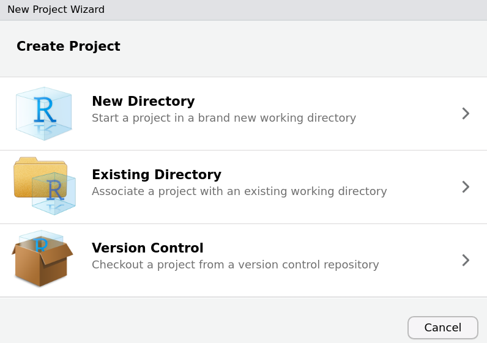
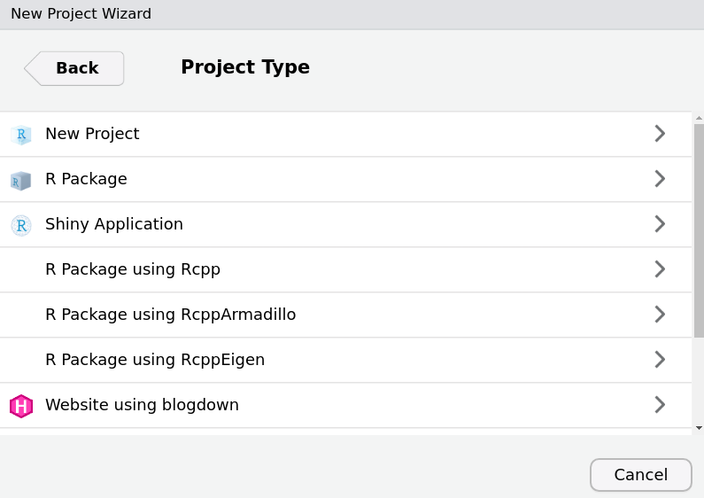
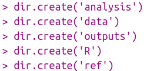

<style> body {text-align: justify} </style>


## Create a research compendium

A research compendium is a folder providing data, code, and documentation, i.e. all you need to get a reproducing scientific workflow ! To create this amazing tool, open RStudio and create a new R-Project : *File > New Project...*

{width=400px}

Choose *New Directory* and then *New Project*.

{width=400px}
A new R-Project is created, it looks like this : 

{width=800px}

Now the project is created, we are going to organize it as a compendium. To do so, write the following command in the R console :  

```{r, eval=FALSE}
rrtools::use_compendium("../Pickachu/", open = FALSE)
```
  
{width=800px}

{width=800px}
  
This function will create 4 new documents : 2 visible (DESCRIPTION and NAMESPACE) and 2 invisible (.Rhistory, .Rbuildignore.). DESCRIPTION is an important file : it will be used to store the packages versions of the project.


{width=400px}

```{r, echo=FALSE, fig.cap="Your are doing a great job - Pokepedia", out.width = '50%'}
knitr::include_graphics("Aligatueur.png")
```


## Complete your project architecture  

Now you can complete your folder architecture with more personal folders. If you work with datas, I suggest you do something like this : 

{width=200px}

The following folders are created in your R-Project.

{width=400px}

The idea is to store your datas in the *data* file, write your functions in the *R* file and your analysis scripts (which call for functions) in the *analysis* file. The results of those analysis will be stored in the *outputs* file.

The data set we will use in this tutorial is about Pokemons. Actually, did you know that there exists many articles about Pokemon ? Here is an exemple [@Kawahara2018] !

##### References 
