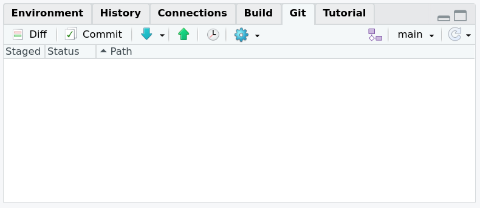
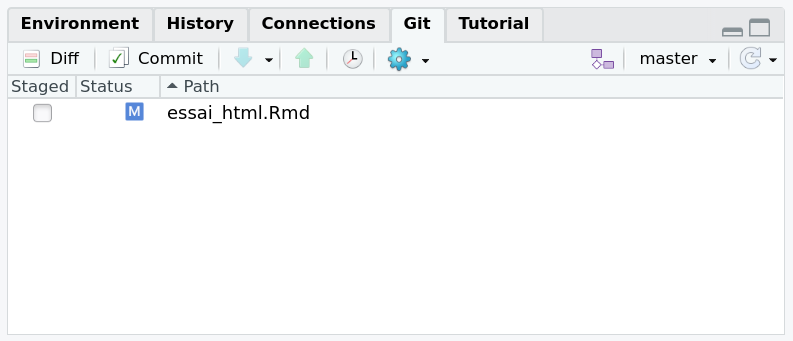
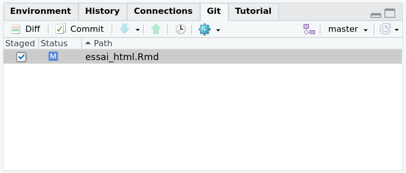
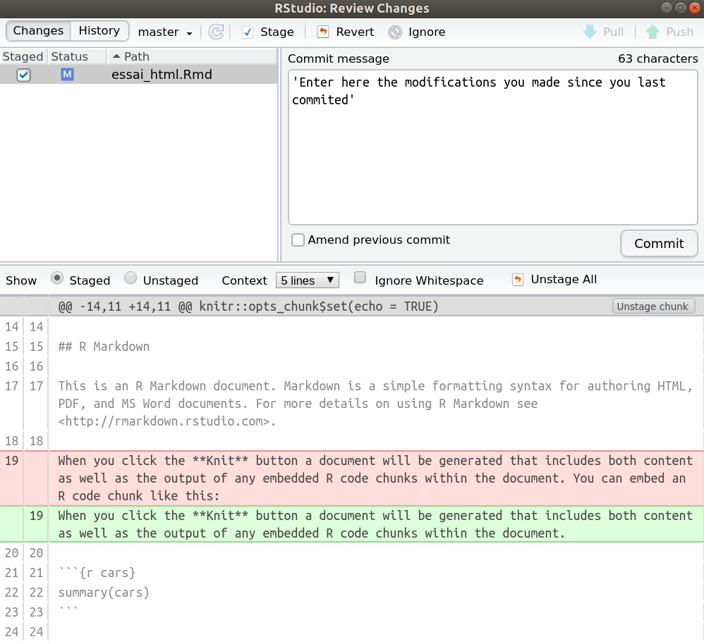

```{r setup, include=FALSE}
knitr::opts_chunk$set(collapse = TRUE)
library(cowplot)
```

## Why Git ?

You now have your new brand research compendium built on your laptop. That's great ! The idea now is to track changes in a project efficiently. To do so, we use git, a control version application. Instead of saving only the latest version, git allows us to take snapshots of the project regularly so that we save a timeline. This is very interesting, especially to : 

- Track all the modifications made by you or your collaborators in the past and enhance reproducibility.
- Restore any old version of the project at anytime.
- Work together efficiently by managing all the contributions and the version conflicts.

{width=200px}


## How to use Git ?

To initialize a Git repository from your project, you can use a simple command from the package `usethis` in the RStudio console : 

```{r, eval=FALSE}
usethis::use_git()
```

RStudio will ask you to restart, and after that, you will observe a new tab **Git** is RStudio :

{width=500px}

Your timeline is now ready to use ! Each time you will make a modification, it will appear in this section.

{width=500px}


To take a snapshot of your project (i.e. to save the actual version of your project), you need to select all the modifications and click on the button `commit`.

{width=500px}
A new window will pop, with detail of the modifications. Before taking the snapshot (before committing), write a comment so you know what modifications correspond to this new version. When that is done, you can click on the button `commit` : the snapshot is done.

{width=500px}

## From local to distance

The easiest way to manage Git repositories is to use GitHub. It's a cloud-based hosting service which allow us to have a nice interface with Git, save the timeline online and work easily with collaborators... To create the link between Git (on our labtop) and GitHub (on the cloud), we use the following command :  

```{r, eval=FALSE}
usethis::use_github()
```

Since GitHub 

```{r, echo=FALSE}
ggdraw() + 
  draw_image("index_files/images/git6.png", width = 0.2) + 
  draw_image("index_files/images/git2.png", width = 0.2, x = 0.2) +
  draw_image("index_files/images/git3.jpg", width = 0.2, x = 0.4) +
  draw_image("index_files/images/git4.png", width = 0.2, x = 0.6) +
  draw_image("index_files/images/git5.png", width = 0.2, x = 0.8)
```


### 1) Creat a new repository on GitHub  

Connect to your GitHub account. Go on **Repositories** tab and click to **New**. For the following exemple I suggest you to name your new GitHub repository **Pickachu** and add a README file, a licence (GNU Affero General Public License v3.0) and a .gitignore (R). By doing that you will create a new repository on GitHub containing 3 files : a .gitignore, a LICENSE and a. README.md visible on github. Then go on **code** tab and copy the SSH link.  

### 2) Install the GitHub repository on your computer 

Now open Rstudio and go here *file* > *new project* > *version control* > *git* past the SSH link and choose the location of the file **Pickachu** that will contain your future project. 
Now if you open your **Pickachu** file on you local computer you will see 3 files: a .Rproj, the LICENSE and the README.md. However 3 others invisible files are in your **Pickachu** file: a .gitignore, a .git and a .Rproj.user. They don’t appear because they are hidden. However you can see them on R studio, GitHub and if you reveal hidden files. 


