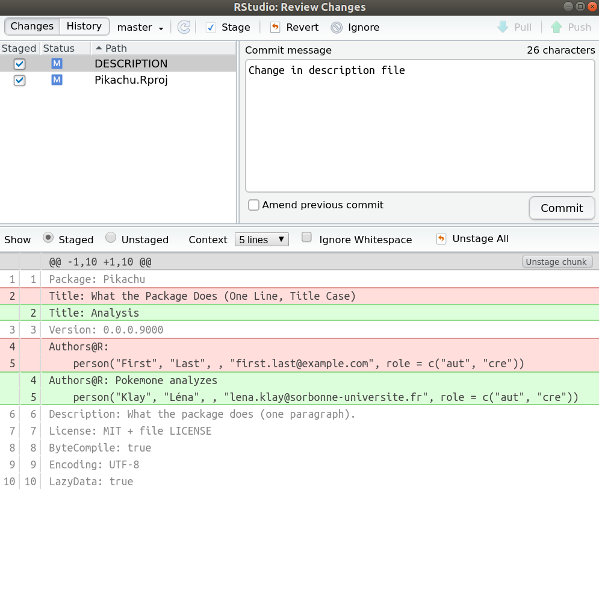
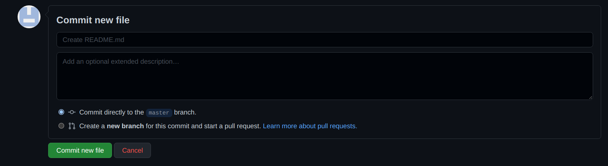

```{r setup, include=FALSE}
knitr::opts_chunk$set(collapse = TRUE)
```

## Why Git ?

You now have a brand new research compendium built on your laptop. That's great ! The next step is to track changes efficiently in the project . To do so we use git which is a control version application : instead of saving only the latest version, git allows us to take snapshots of the project regularly so that we save the full timeline. This is very interesting, especially to : 

- Track all the modifications made by you or your collaborators in the past and enhance reproducibility.
- Restore any old version of the project at any time.
- Work together efficiently by managing contributions and solve possible version conflicts.

{width=200px}


## How to use Git ?

To initialize a Git repository from your project, you can use a simple command from the package `usethis` in the RStudio console : 

```{r, eval=FALSE}
usethis::use_git()
```

{width=500px}
{width=500px}

RStudio will ask you to restart and after that, you will observe a new **Git** tab in RStudio, and a bunch of new files and folders :

{width=500px}


Your timeline is now ready to use ! Each time you will make a modification, it will appear in the git tab. Let's try it ! We are going to change the description file to indicate what the project is about : 

{width=500px}

The modification on the description file is now visible in the git tab : 

{width=500px}

To take a snapshot of your project (i.e. to save the actual version of your project), you need to select all the modifications and click on the button `commit`.

{width=500px}


A new window will pop up, with details of the modifications. Before taking the snapshot (before committing), write a comment so you know what improvements you made in this new version. When that is done, you can click on the button `commit` : the snapshot is done. The git tab is clean again.

{width=500px}


## From local to distance

The easiest way to manage Git repositories is to use GitHub. It's a cloud-based hosting service which allow us to have a nice interface with Git, save the timeline online and work easily with collaborators... To create the link between Git (on our labtop) and GitHub (on the cloud), we use the following command :  

```{r, eval=FALSE}
usethis::use_github()
```

{width=500px}
{width=500px}


Since GitHub is a bit grumpy with token, if you get an error make sure you have done well the last instruction of the toolbox file (available 
[here](https://frbcesab.github.io/datatoolbox/instructions.html) ) :

{width=500px}
If everything went well, a new repository has been created in your GitHub account.

{width=1000px}

To do everything perfectly, you need to had a README.md file, to inform everyone what your project is about. To do so click on 'Add a README' and complete the file.

{width=1000px}
{width=1000px}
Don't forget to commit your change... and that's it, you are now ready to work ! 


# From Github to RStudio : the other way to do it

Another (and simpler) way to do this is to create a project from GitHub and to upload it in your computer (locally). To do so, connect to your GitHub account, go in **Repositories** tab and click to **New**. Allow GitHub to add a README file, a licence (GNU Affero General Public License v3.0) and a .gitignore (R). The new repository created on GitHub contains 3 files : a .gitignore, a LICENSE and a. README.md. Then go on **code** tab and copy the SSH link.  

Now open Rstudio and click on *file* > *new project* > *version control* > *git*. Paste the SSH link and choose the location of the file that will contain your future project. This new project will immediately be linked to your GitHub repository. Once the project is created locally you will see 3 files: a .Rproj, the LICENSE and the README.md. However 3 others invisible files are created : a .gitignore, a .git and a .Rproj.user. They are hidden, but you can see them on R studio or GitHub if you reveal hidden files. You can now complete your compendium by creating the different files needed, as in the previous tutorial. 


<br/>


{width=800px}

