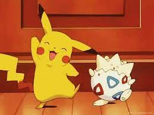
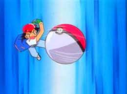
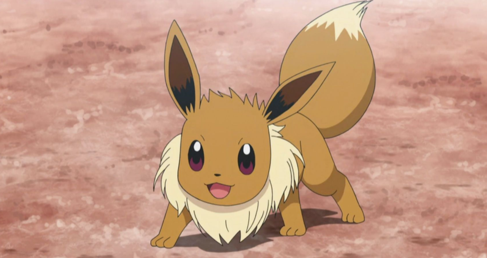
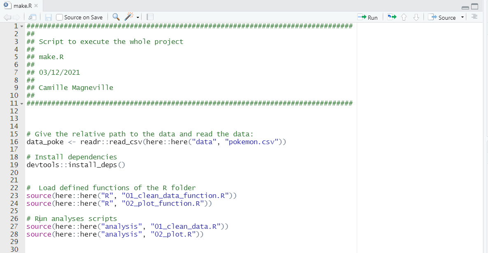
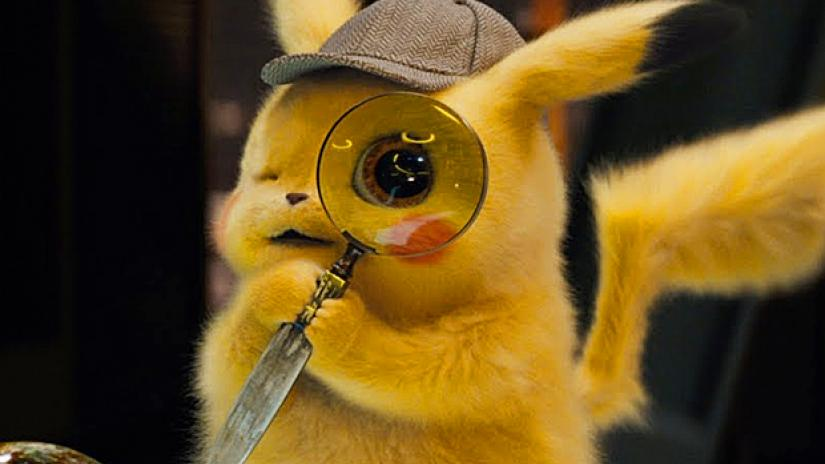

## Why using an automatised workflow? 


When you are coding, your life is a succession of: launching your code, 
waiting while it runs, discovering an issue and ... restarting from scratch: 

{width=200px}


So, to make your code life easier you can **automatised your worklow so that 
re-running all your analysis only consist in running one file**!


Dependencies between the different steps of your analysis workflow have to be 
stated by using a `make.R` file <span style="color: grey;">(easy if your 
worklow is linear that is to say if one step leads to another unique one)</span> or <span style="color: purple;">the targets package</span> <span style="color: grey;">(easier to use than the `make.R` file if your worklow is not linear)</span>


In this tutorial, we will see the two methods starting with the `make.R` file. 
**We assumed that you have already done the** *03 - Create and define your first R function and analysis script* 


## A - Using the `make.R` file


You have to create a `make.R` file on the project root, for instance by using 
<span style="color: purple;">the file.create() function</span> or by using 
*File > New File > Rscript* if using RStudio and then saving the file on the 
project root:


```{r, eval = FALSE}
# Command to create a make.R file on the project root if not done before:
file.create("make.R")
```


This file will contains everything needed to run your project: for instance
loading the dependencies your project relies on, functions you have coded, 
sourcing scripts containing code for your analysis *etc.*. In this method,
running this folder will run the whole workflow!


<span style="color: aquamarine;">A - 1 - Load the data and depencies </span> 


* The first thing to code in the `make.R` file is to **automatise the data loading**.  
To do so you must use <span style="color: purple;">the here package</span> 
([link to the here website](https://here.r-lib.org/)): it helps to use **relative paths** 
(defined on the project root) instead of absolute ones as everyone as a different 
absolute path. 

*In our example*, we will load the *Pokemon* dataset, which is in the `data folder` on the project root.  
We use </span><span style="color: purple;">the here() function of the here package</span> the different arguments = parameters of the function are the folders of the path leading to the file and the name of the file to open as follows: 


```{r, eval = FALSE}
 # 1st line of the make.R: give the relative path to the data and read the data:
  data_poke <- readr::read_csv(here::here("data", "pokemon.csv"))
```
 

**NOTE:** Using package_name::function_name and not `library(package_name)` because
different functions belonging to different packages can have the same name, thus
using this coding style helps the code readability and prevent conflicts.


* Then, we must **automatise dependencies loading** that is to say the name of the 
packages used in the functions we have created and defined.  

*Reminder:* In the tutorial *03 - Create and define your first R function and analysis script*, these dependencies have been added to the `Import` part of the `DESCRIPTION file` by
using the following command:


```{r, eval = FALSE}
# command to add dependencies to the DESCRIPTION file:
usethis::use_package("name_of_the_package")
```


To install the dependencies your project is relying on, use </span> <span style="color: purple;">the install_deps() function of the devtools package</span> as follow:


```{r, eval = FALSE}
 # 2nd line of the make.R: install dependencies
devtools::install_deps()
```

The first two lines of the `make.R` file are coded!


{width=200px}

<span style="color: aquamarine;">A - 2 - Source your R functions </span> 


If you have defined and coded specific R functions collected in the `R folder` on the project root, you have to source the file(s) that contain(s) them. It allows the use of these functions in the R scripts for the analysis. To do so, you use </span> <span style="color: purple;">the source function</span> and
we **never forget to use relative paths using </span> <span style="color: purple;">the here package</span>**:


```{r, eval = FALSE}
 # 3rd and 4rth lines of the make.R: load defined functions of the R folder
source(here::here("R", "01_clean_data_function.R"))
source(here::here("R", "02_plot_function.R"))
```
 
Now our functions are sourced! 

{width=200px}


<span style="color: aquamarine;">A - 3 - Source your R scripts for analysis </span> 


Then, the last step is to run the R script(s) containing code for analysis. They are usually contained in an `analysis folder` and some of them (or all of them) can call functions you have coded (and which are in the `R folder`).   

You have already coded some R scripts for the analysis in the *03 - Create and define your first R function and analysis script* tutorial. Thus we are sourcing these files using the following command:


```{r, eval = FALSE}
# 5th and 6th lines of the make.R: run analyses scripts
source(here::here("analysis", "01_clean_data.R"))
source(here::here("analysis", "02_plot.R"))
```


Now our scripts for analyses are sourced, we are ready to compute the whole project!


{width=200px}


<span style="color: aquamarine;">A - 4 - Have a look to your finished `make.R` file </span> 


The `make.R` file is now finished for our Pikachu Project! If you want to re-run all your project, you just have to run this file and in only one step, everything is computed, how nice!


{width=400px}

<br>

## B - Using <span style="color: purple;">the targets package</span> 


The goal of the <span style="color: purple;">the targets package</span> is to automatise the workflow while taking into account the dependencies between the different steps. It can be used **when the workflow is not linear** (on the contrary of the use of the `make.R` file). Using the <span style="color: purple;">the targets package</span>, you can **create a map of the links** between the different steps and **only rerun steps which changes since the last run**! Awesome, don't you think?! It is thus a very usefull thing to use when working with big data. 


{width=300px}


The use of the <span style="color: purple;">the targets package</span> depends on a file (similar to the `make.R`) which you will call to re-reun all your analysis. So let's create this new file!

```{r, eval = FALSE}
# create the new file at the project root
file.create("_target.R")
```


